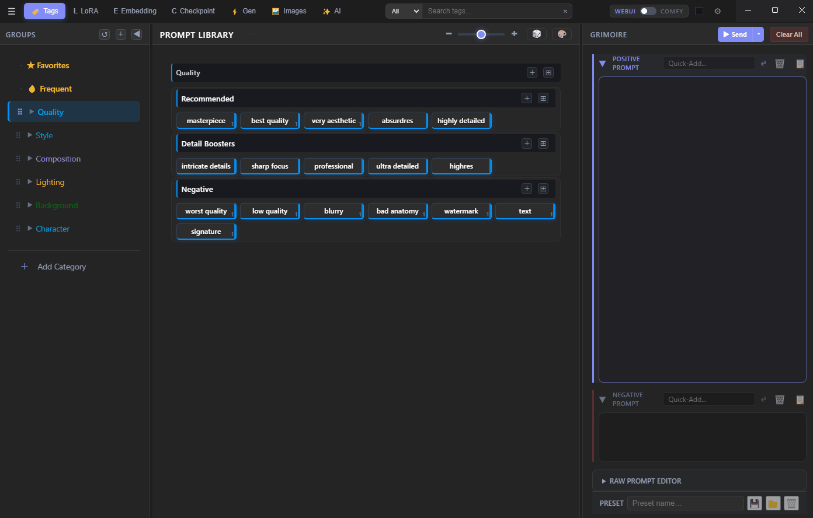
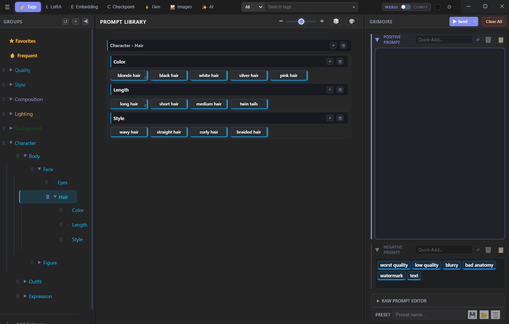
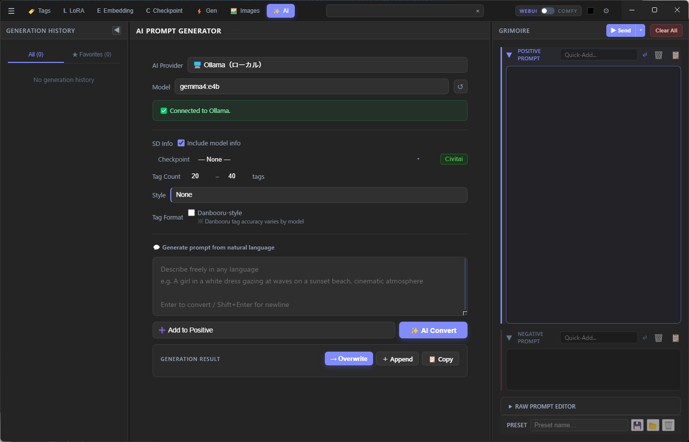
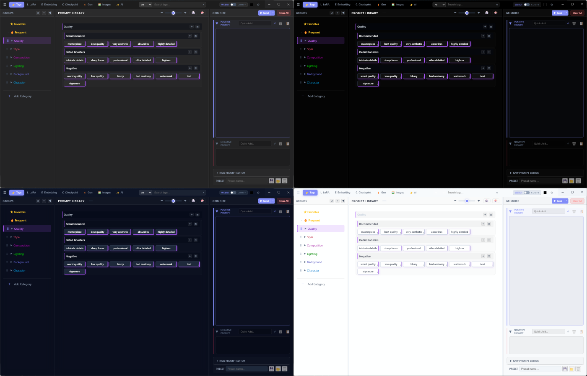
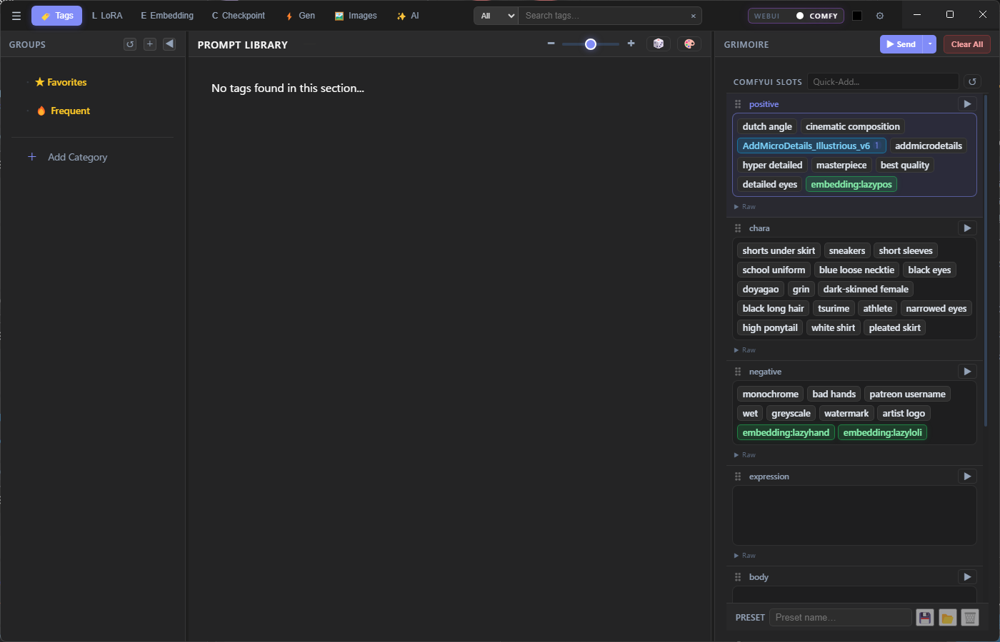

# grimoire

**Stable Diffusion / ComfyUI 向けプロンプトライブラリ & ビルダー**

> English: [README.md](README.md)

---

## はじめに

プロンプト管理ツールをいろいろ試してきましたが、欲しい機能が足りなかったり一覧性がなかったりして、なかなかしっくりくるものがありませんでした。そこで、自分が本当に欲しいと思った機能を詰め込んで設計したのが grimoire です。WebUI・ComfyUI へのプロンプト入力を、簡単に・直感的に・すばやく書き換えられることを目指しています。

タグは色分けされたチップとして表示されるため、プロンプト全体を一目で把握できます。ライブラリの1つのボタンに複数のタグをまとめて登録できるので、プリセットのように使えます。カテゴリ・グループ・サブグループ単位でのランダム化もワンクリックで可能。danbooruタグのオートコンプリートで目的のタグもすばやく見つかります。

タグ画面には**スタイルパレット**を用意しています。カラー・素材・柄・デコレーションなどの装飾ワードをワンクリックで入力でき、タグに手軽にバリエーションを加えられます。

**AI モード**では Ollama（ローカル）・Claude API・OpenAI に対応。自然言語でイメージを入力するだけで、SD 用プロンプトを自動生成します。

**Images モード**では生成画像をグリッドで一覧表示。PNG メタデータのコピーや、生成情報のワンクリックでの grimoire への反映が可能です。タグ・ファイル名・モデル名での検索にも対応しています。

**LoRA / Embedding / Checkpoint モード**では CivitAI からメタデータを直接取得できます。サムネイル・トリガーワード・ベースモデル情報などを手軽に入手できます。

**Gen モード**では各種生成設定を管理。解像度やアスペクト比の変更もすばやく行えます。

---



---

## 機能

### ライブラリ & ビルダー
タグを YAML ファイルでカテゴリ・グループに整理。タグをクリックすると Builder にチップとして追加されます。チップはドラッグで並び替え、Positive / Negative 間の移動も可能です。


### スタイルパレット
Mod / Color / Material / Pattern / Deco のスタイル修飾子をワンクリックで適用。カラー・素材・柄・デコレーションなどの装飾ワードを手打ちせずに入力でき、選択したスタイルはプロンプト先頭に自動で付与されます。



### AI アシスト
自然言語で説明を入力するだけで、SD 用プロンプトを AI が生成します。**Ollama**（ローカル）・**Claude API**・**OpenAI** に対応。



### 生成設定
Checkpoint・VAE・サンプラー・ステップ数・解像度・Hires.fix・Refiner を設定して、WebUI または ComfyUI に直接送信できます。


### 画像ブラウザ
出力フォルダをサムネイルグリッドで閲覧。PNG メタデータ（プロンプト・シード・生成パラメータ）をアプリ内で確認できます。


### タグ画像
タグカードにサムネイル画像を登録できます。ライブラリのタグカードに画像ファイルをドラッグ＆ドロップするか、画像ブラウザで生成画像を右クリックして **タグ画像として登録** を選択してください。

### CivitAI 連携
LoRA・Embedding・Checkpoint のメタデータを CivitAI から直接取得できます。アセットカードを右クリックして **情報を取得 (CivitAI)** を選択すると、カバー画像・推奨ワード・ベースモデル・説明文が自動で反映されます。LoRA / Embedding モードの **Fetch All** ボタンで未取得のアセットを一括取得できます。**設定 → アセット** に CivitAI API キーを設定するとレート制限を回避できます。

### テーマ
**Navy・White・Black・Gray** の 4 テーマを内蔵。



---

## セットアップ

1. [Releases](../../releases) から **grimoire.exe** をダウンロード
2. 専用フォルダ（例: `grimoire/`）を作成し、その中に exe を置く
3. `grimoire.exe` を起動

初回起動時に、exe と同じ階層に以下のフォルダが自動生成されます。

| フォルダ | 内容 |
|----------|------|
| `data/` | 設定ファイル・タグ画像 |
| `tag/` | YAML タグライブラリファイル（サンプル付き） |
| `gen_presets/` | 生成プリセットの保存先 |
| `prompt_presets/` | プロンプトプリセットの保存先 |

専用フォルダの中で起動することで、これらのフォルダが散らばるのを防げます。

### ソースから起動（開発者向け）

[Node.js](https://nodejs.org/) v18 以上と [Git](https://git-scm.com/) が必要です。

```bash
git clone https://github.com/omamesamba-del/grimoire.git
cd grimoire
npm install
npm start
```

---

## YAML ライブラリ形式

`tag/` フォルダに `.yml` ファイルを置くと起動時に自動で読み込まれます。  
タグが反映されない場合や yml を手動で編集した場合は、ハンバーガーメニューの **YAML 再読み込み** で再起動せずに更新できます。

```yaml
- category: マイカテゴリ
  color: "#4a9eff"
  tags:
    - name: マイグループ
      tags:
        - masterpiece
        - best quality
        - name: サブセクション
          tags:
            - detailed background
            - cinematic lighting
```

---

## WebUI ブリッジ

**リポジトリ:** [sd-webui-grimoire-bridge](https://github.com/omamesamba-del/sd-webui-grimoire-bridge)

AUTOMATIC1111 / Forge / SD.Next に `/grimoire/v1/set-prompt` エンドポイントを追加し、grimoire からプロンプトと生成設定を直接送信できるようにします。

**インストール:**
```bash
cd extensions
git clone https://github.com/omamesamba-del/sd-webui-grimoire-bridge.git
```
WebUI を再起動後、grimoire の **設定 → 生成設定** で WebUI の URL を設定してください（デフォルト: `http://127.0.0.1:7860`）。

---

## ComfyUI ブリッジ

**リポジトリ:** [comfyui-grimoire-bridge](https://github.com/omamesamba-del/comfyui-grimoire-bridge)

**インストール:**
```bash
cd custom_nodes
git clone https://github.com/omamesamba-del/comfyui-grimoire-bridge.git
```
ComfyUI を再起動後、grimoire の **設定 → 生成設定** で ComfyUI の URL を設定してください（デフォルト: `http://127.0.0.1:8188`）。

### ComfyUI モードの仕組み

ComfyUI 連携は WebUI より柔軟です。Positive / Negative の固定ペアではなく、**任意の数の名前付きスロット**をワークフロー内の好きな場所に接続できます。



右上のトグルで grimoire を **COMFY モード**に切り替えると、ビルダーパネルが **ComfyUI Slots** 表示に変わります。現在開いているワークフローの Grimoire Slot ノードを自動検出し、スロットごとにパネルが表示されます。スロットをクリックしてアクティブにし、ライブラリのタグをクリックすると、そのスロットにタグが追加されます。`⠿` ハンドルをドラッグしてスロットの並び順を変更できます。

### ワークフローのセットアップ


ブリッジは **PromptBuilder** カテゴリに 3 種類のカスタムノードを追加します。

| ノード | 説明 |
|--------|------|
| **Grimoire Slot** | 名前付きテキストスロット。`slot_name`（例: `positive`、`chara`、`negative`）を設定し、出力を CLIP Text Encode など任意の STRING 入力に接続します。 |
| **Grimoire Join** | 複数の Grimoire Slot 出力を区切り文字で結合します。**+** ボタンで入力を追加できます。 |
| **Grimoire Params** | 生成設定をまとめて受け取るオールインワンノード。Checkpoint・VAE・サンプラー・ステップ数・解像度などを grimoire の Gen タブから受信し、MODEL / CLIP / VAE と数値パラメータを出力します。 |

**基本的なセットアップ手順:**
1. テキストエリアごとに **Grimoire Slot** ノードを追加し、スロット名を付ける（例: `positive`・`chara`・`negative`・`expression`）
2. 各スロットの出力を CLIP Text Encode に接続（複数スロットをまとめる場合は **Grimoire Join** を経由）
3. 必要に応じて **Grimoire Params** を追加し、KSampler やローダーに接続
4. grimoire を COMFY モードに切り替えると、スロット名が自動検出されてパネルに表示される
5. grimoire でプロンプトを組み立て、**Send**（または `Ctrl+Enter`）で全スロットを送信して生成を開始

---

## キーボードショートカット

| キー | 操作 |
|------|------|
| `T` | Tags モード |
| `L` | LoRA モード |
| `E` | Embedding モード |
| `G` | Generation モード |
| `I` | Images モード |
| `A` | AI Assist モード |
| `Ctrl+Z` / `Ctrl+Y` | プロンプトの Undo / Redo |
| `Ctrl+Enter` | WebUI / ComfyUI に送信 |
| `Ctrl+,` | 設定を開く |
| `F2` | 選択項目のリネーム |

ショートカットは **設定 → ショートカット** から自由にカスタマイズできます。

---

## ライセンス

MIT

---

> **注意:** このアプリケーションは AI（Anthropic Claude）の支援を受けて開発されています。
