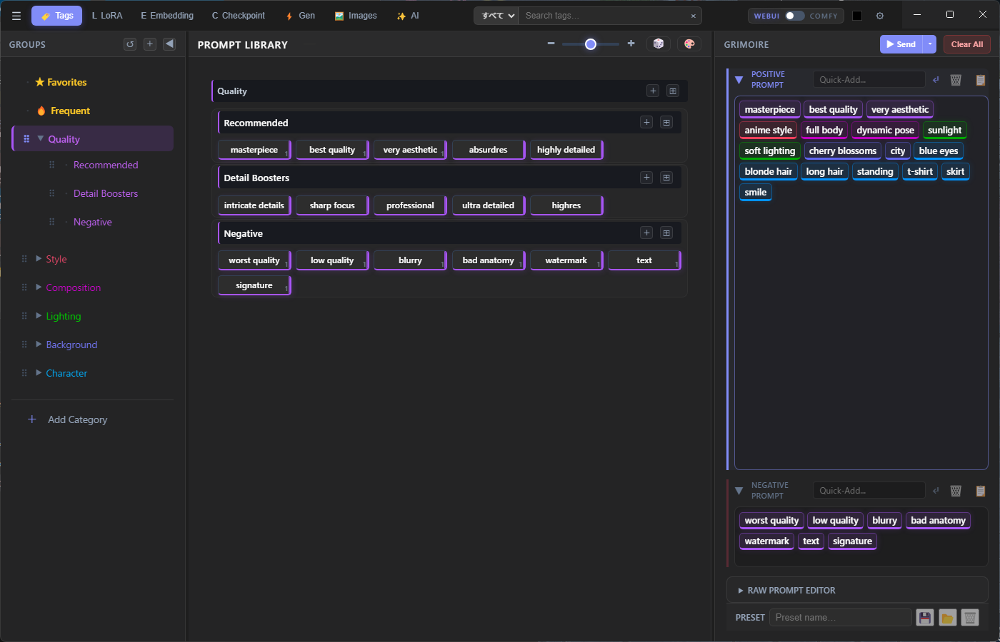
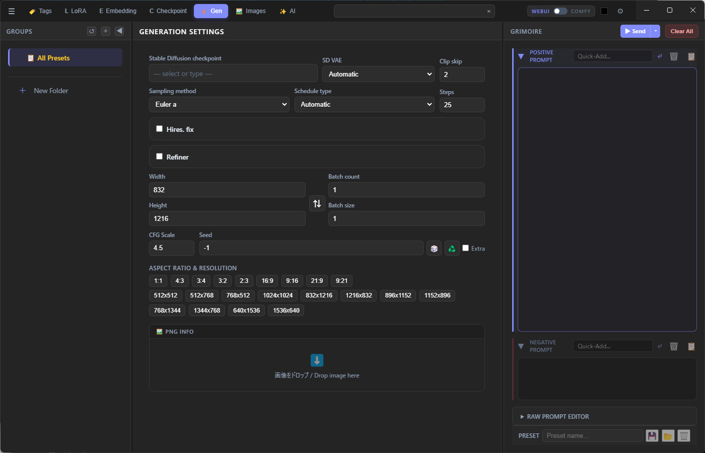
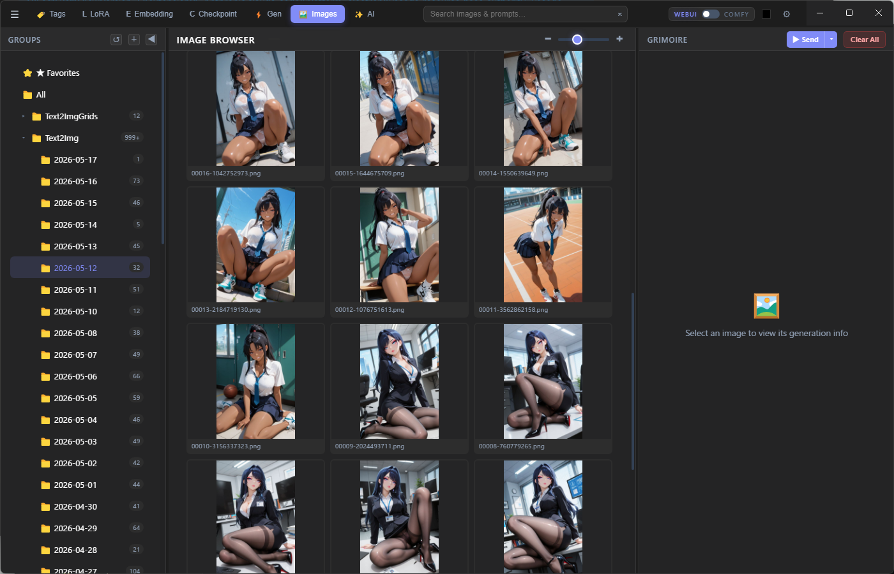

# grimoire

**A prompt library and builder for Stable Diffusion / ComfyUI.**

Organize your tags in YAML files, build prompts visually with drag-and-drop chips, and send them directly to AUTOMATIC1111, Forge, or ComfyUI — all from a single desktop app.

> 日本語版: [README.ja.md](README.ja.md)

---



---

## Features

### Library & Builder
Organize thousands of tags into categories and groups with YAML files. Click tags to add them as chips in the Builder. Drag chips to reorder or move between Positive and Negative areas.

### Style Palette
Apply style modifiers (Mod / Color / Material / Pattern / Deco) to any tag with a single click. Styles are prepended to your prompt automatically.

### AI Assist
Describe what you want in plain text and let the AI generate SD-ready prompts. Supports **Ollama** (local), **Claude API**, and **OpenAI**.


### Generation Settings
Configure checkpoint, VAE, sampler, steps, resolution, Hires.fix, and Refiner — then send directly to WebUI or ComfyUI.



### Images Browser
Browse your output folder with a thumbnail grid. View PNG metadata (prompt, seed, generation params) inline.



### Themes
Four built-in themes: **Navy**, **White**, **Black**, **Gray**.


---

## Getting Started

1. Download **grimoire.exe** from [Releases](../../releases)
2. Create a dedicated folder (e.g. `grimoire/`) and place the exe inside
3. Run `grimoire.exe`

On first launch, grimoire automatically creates the following folders next to the exe:

| Folder | Contents |
|--------|----------|
| `data/` | App config and settings |
| `tag/` | Your YAML tag library files |

Keeping the exe in its own folder prevents these from being scattered across your filesystem.

### Run from source (developers)

Requires [Node.js](https://nodejs.org/) v18+ and [Git](https://git-scm.com/).

```bash
git clone https://github.com/omamesamba-del/grimoire.git
cd grimoire
npm install
npm start
```

---

## YAML Library Format

Place `.yml` files in the `tag/` folder. grimoire reads them automatically on startup.  
If tags don't appear or you've edited a file manually, use **Reload YAML** from the hamburger menu to refresh without restarting.

```yaml
- category: My Category
  color: "#4a9eff"
  tags:
    - name: My Group
      tags:
        - masterpiece
        - best quality
        - name: Subsection
          tags:
            - detailed background
            - cinematic lighting
```

---

## WebUI Bridge

**Repository:** [sd-webui-grimoire-bridge](https://github.com/omamesamba-del/sd-webui-grimoire-bridge)

Extends AUTOMATIC1111 / Forge / SD.Next with a `/grimoire/v1/set-prompt` endpoint so grimoire can push prompts and generation settings directly.

**Install:**
```bash
cd extensions
git clone https://github.com/omamesamba-del/sd-webui-grimoire-bridge.git
```
Restart WebUI, then set the WebUI URL in grimoire under **Settings → Generation** (default: `http://127.0.0.1:7860`).

---

## ComfyUI Bridge

**Repository:** [comfyui-grimoire-bridge](https://github.com/omamesamba-del/comfyui-grimoire-bridge)

Adds a **Grimoire Slot** node to ComfyUI. grimoire sends prompts to named slots, so you can wire them anywhere in your workflow.

**Install:**
```bash
cd custom_nodes
git clone https://github.com/omamesamba-del/comfyui-grimoire-bridge.git
```
Restart ComfyUI. Add a **Grimoire Slot** node, give it a slot name, then set the ComfyUI URL and slot name in grimoire under **Settings → Generation** (default: `http://127.0.0.1:8188`).

---

## Keyboard Shortcuts

| Key | Action |
|-----|--------|
| `T` | Tags mode |
| `L` | LoRA mode |
| `E` | Embedding mode |
| `G` | Generation mode |
| `I` | Images mode |
| `A` | AI Assist mode |
| `Ctrl+Z` / `Ctrl+Y` | Undo / Redo (prompt) |
| `Ctrl+Enter` | Send to WebUI / ComfyUI |
| `F2` | Rename selected item |

Shortcuts are fully customizable under **Settings → Shortcuts**.

---

## License

MIT

---

> **Note:** This application was developed with the assistance of AI (Claude by Anthropic).
