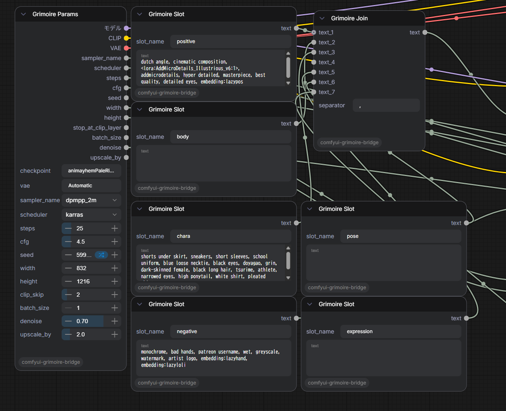

# grimoire

**A prompt library and builder for Stable Diffusion / ComfyUI.**

> 日本語版: [README.ja.md](README.ja.md)

---

## Introduction

I tried a lot of prompt management tools, but none of them felt quite right — missing features here, poor overview there. So I built grimoire with exactly the features I wanted: making prompt input for WebUI and ComfyUI easy, intuitive, and quick to edit.

Tags are displayed as color-coded chips, so your prompt is always easy to read at a glance. A single library button can hold multiple tags at once, acting like a preset. You can also randomize within any category, group, or subgroup with a single click. Danbooru tag autocomplete helps you find the right tags fast.

**AI mode** connects to Ollama (local), Claude API, or OpenAI to generate SD-ready prompts from plain natural language — just describe what you want.

**Images mode** lets you browse your generated images in a grid, copy PNG metadata, and apply generation settings back to grimoire in one click. Search by tag, filename, or model name.

**LoRA / Embedding / Checkpoint modes** can fetch metadata directly from CivitAI — thumbnails, trigger words, base model info, and more.

**Gen mode** gives you full control over generation settings, with quick resolution and aspect ratio presets built in.

---


---

## Features

### Library & Builder
Organize thousands of tags into categories and groups with YAML files. Click tags to add them as chips in the Builder. Drag chips to reorder or move between Positive and Negative areas.


### Style Palette
Apply style modifiers (Mod / Color / Material / Pattern / Deco) to any tag with a single click. Styles are prepended to your prompt automatically.

### AI Assist
Describe what you want in plain text and let the AI generate SD-ready prompts. Supports **Ollama** (local), **Claude API**, and **OpenAI**.


### Generation Settings
Configure checkpoint, VAE, sampler, steps, resolution, Hires.fix, and Refiner — then send directly to WebUI or ComfyUI.


### Images Browser
Browse your output folder with a thumbnail grid. View PNG metadata (prompt, seed, generation params) inline.


### Tag Images
Attach a preview image to any tag — it appears as a thumbnail on the tag card. To register an image, drag and drop an image file directly onto a tag card in the library, or right-click a generated image in the Images Browser and select **Use as tag image**.

### CivitAI Integration
Fetch metadata for LoRA, Embedding, and Checkpoint files directly from CivitAI. Right-click any asset card and choose **Fetch Info (CivitAI)** to pull the cover image, trained words, base model, and description. Use **Fetch All** in LoRA / Embedding mode to batch-fetch metadata for all assets at once. A CivitAI API key can be set in **Settings → Assets** to avoid rate limiting.

### Themes
Four built-in themes: **Navy**, **White**, **Black**, **Gray**.


---

## Getting Started

1. Download **grimoire.exe** from [Releases](../../releases)
2. Create a dedicated folder (e.g. `grimoire/`) and place the exe inside
3. Run `grimoire.exe`

On first launch, grimoire automatically creates the following folders next to the exe:

| Folder | Contents |
|--------|----------|
| `data/` | App config, settings, and tag images |
| `tag/` | YAML tag library files (sample files included) |
| `gen_presets/` | Saved generation presets |
| `prompt_presets/` | Saved prompt presets |

Keeping the exe in its own folder prevents these from being scattered across your filesystem.

### Run from source (developers)

Requires [Node.js](https://nodejs.org/) v18+ and [Git](https://git-scm.com/).

```bash
git clone https://github.com/omamesamba-del/grimoire.git
cd grimoire
npm install
npm start
```

---

## YAML Library Format

Place `.yml` files in the `tag/` folder. grimoire reads them automatically on startup.  
If tags don't appear or you've edited a file manually, use **Reload YAML** from the hamburger menu to refresh without restarting.

```yaml
- category: My Category
  color: "#4a9eff"
  tags:
    - name: My Group
      tags:
        - masterpiece
        - best quality
        - name: Subsection
          tags:
            - detailed background
            - cinematic lighting
```

---

## WebUI Bridge

**Repository:** [sd-webui-grimoire-bridge](https://github.com/omamesamba-del/sd-webui-grimoire-bridge)

Extends AUTOMATIC1111 / Forge / SD.Next with a `/grimoire/v1/set-prompt` endpoint so grimoire can push prompts and generation settings directly.

**Install:**
```bash
cd extensions
git clone https://github.com/omamesamba-del/sd-webui-grimoire-bridge.git
```
Restart WebUI, then set the WebUI URL in grimoire under **Settings → Generation** (default: `http://127.0.0.1:7860`).

---

## ComfyUI Bridge

**Repository:** [comfyui-grimoire-bridge](https://github.com/omamesamba-del/comfyui-grimoire-bridge)

**Install:**
```bash
cd custom_nodes
git clone https://github.com/omamesamba-del/comfyui-grimoire-bridge.git
```
Restart ComfyUI, then set the ComfyUI URL in grimoire under **Settings → Generation** (default: `http://127.0.0.1:8188`).

### How ComfyUI Mode Works

ComfyUI integration is more flexible than WebUI — instead of a single positive/negative pair, you can have **any number of named slots** that map directly to nodes in your workflow.


Switch grimoire to **COMFY mode** using the toggle in the top-right corner. The builder panel changes to show **ComfyUI Slots** — one panel per Grimoire Slot node detected in your open workflow. Click a slot to make it the active target, then click tags from the library to add them there. Drag the `⠿` handle to reorder slots.

### Setting Up the Workflow



The bridge provides three custom nodes, all found under the **PromptBuilder** category:

| Node | Description |
|------|-------------|
| **Grimoire Slot** | A named text slot. Set `slot_name` (e.g. `positive`, `chara`, `negative`) and connect the output to any STRING input — typically a CLIP Text Encode node. |
| **Grimoire Join** | Joins multiple Grimoire Slot outputs into one string with a configurable separator. Use the **+** button to add more inputs. |
| **Grimoire Params** | All-in-one generation settings node. Receives checkpoint, VAE, sampler, steps, resolution, and more from grimoire's Gen Settings tab. Outputs MODEL, CLIP, VAE, and all numeric params. |

**Typical setup:**
1. Add one **Grimoire Slot** node per text area (e.g. `positive`, `chara`, `negative`, `expression`)
2. Connect each slot's output to a CLIP Text Encode node (or use **Grimoire Join** to combine multiple slots first)
3. Optionally add **Grimoire Params** and connect its outputs to your KSampler and loaders
4. In grimoire, switch to COMFY mode — the slots panel will auto-detect your slot names
5. Build your prompt in grimoire, then press **Send** (or `Ctrl+Enter`) to push all slots and queue generation

---

## Keyboard Shortcuts

| Key | Action |
|-----|--------|
| `T` | Tags mode |
| `L` | LoRA mode |
| `E` | Embedding mode |
| `G` | Generation mode |
| `I` | Images mode |
| `A` | AI Assist mode |
| `Ctrl+Z` / `Ctrl+Y` | Undo / Redo (prompt) |
| `Ctrl+Enter` | Send to WebUI / ComfyUI |
| `Ctrl+,` | Open Settings |
| `F2` | Rename selected item |

Shortcuts are fully customizable under **Settings → Shortcuts**.

---

## License

MIT

---

> **Note:** This application was developed with the assistance of AI (Claude by Anthropic).
